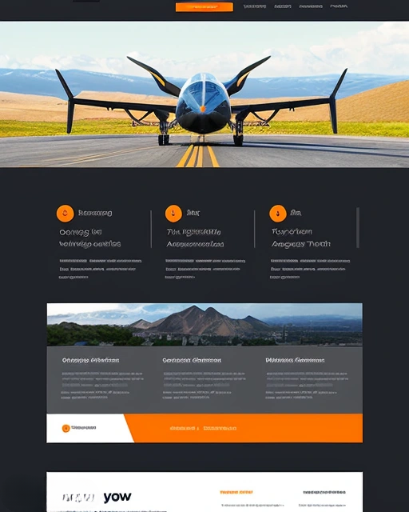

# ALTITUDE MÁXIMA PARAQUEDISMO

## Descrição do projeto

- Landing Page fictícia para uma empresade paraquedismo radical.

## Funcionalidades pretendidas

- Vídeo 4k contínuo no hero;
- Seção galeria altamente interativa;

## Tecnologias 

### Front-end

- React
- Typescript
- Tailwind
- Vite

### Back-end

## Objetivos do projeto

1) Continuar meus aprendizados em front-end;
2) Aprender a usar um vídeo no hero section;
3) Descobrir novas formas de tornar uma página visusalmente atraente;
4) Continuar aprimorando minhas capacidades de transformar um modelo abstrato de página em algo palpável, atraente e comercialmente efetivo.

## Recursos:

### Inspiração visual:

- Imagem produzida por AI (playground.com)

### Fontes

h1 - Bebas Neue
h2 ... h6, a, button - Montserrat
p - Open Sans

### Copy da Página

1) Header:

- Inicio
- Sobre
- Modalidades
- Galeria
- Depoimentos
- FAQ

2) Hero

h1 - Eleve sua Experiência: Salte com Altitude Máxima
h2 - Adrenalina, Liberdade e Vista Inigualável
button - Agendar Salto

3) Sobre

h3 - Quem Somos

p - Na Altitude Máxima, oferecemos uma experiência de paraquedismo que vai além do ordinário. Fundada por amantes de adrenalina e especialistas em salto livre, nossa missão é proporcionar emoções inesquecíveis e vistas espetaculares do céu.

4) Modalidades

h3 - Saltando com a Gente

p - Descubra nossas modalidades de salto, desde o tandem para iniciantes até os saltos avançados para paraquedistas experientes.

flexbox

coluna 1

ícone
h4 - Salto Tandem

p - Para iniciantes que querem experimentar a sensação do salto com total segurança. Salte com um instrutor confiável e profissional.

coluna 2

ícone
h4 - Salto Solo

p - Paraquedistas experientes podem desfrutar da liberdade do salto solo. Desbrave os céus de Campo Grande, à sua maneira.

colune 3

ícone
h4 - Salto em Formação

p - Desafie-se com saltos em equipe e crie formações aéreas espetaculares. Embeleze os céus da capital com visuais estonteantes.

button - Qual o mais indicado para mim?

5) Galeria

h3 - Emoções Para Toda a Vida...

- inserir galeria de imagens

6) Depoimentos

h3 - ...e Histórias para Recordar!

Ana Oliveira
"Nunca imaginei que sentiria tanta liberdade! O salto tandem com a Altitude Máxima foi simplesmente incrível. A equipe é super profissional e me fez sentir segura o tempo todo. A vista e a adrenalina são indescritíveis. Mal posso esperar para repetir a dose!"

Carlos Mendes
"Eu sou um paraquedista experiente, mas o salto solo com a Altitude Máxima superou todas as minhas expectativas. A preparação foi impecável e a sensação de planeio livre foi algo que eu nunca tinha vivido antes. É o melhor lugar para quem busca emoção de verdade."

Juliana Santos
"Participar do salto em formação foi uma experiência que vou levar para a vida toda. A equipe da Altitude Máxima não só garantiu que tudo fosse seguro, como também criou um ambiente de camaradagem e diversão. Foi um desafio, mas valeu cada segundo!"

Ricardo Lima
"A equipe da Altitude Máxima é excepcional. Desde o momento em que chegamos até o salto, tudo foi perfeito. A segurança e o profissionalismo são de primeira linha. Se você está procurando uma experiência de paraquedismo radical, este é o lugar!"

Beatriz Ferreira
"Nunca pensei que poderia me sentir tão livre e emocionada ao mesmo tempo. O salto tandem foi uma experiência de vida para mim, e a equipe da Altitude Máxima fez com que eu me sentisse confortável e confiante o tempo todo. Recomendo a todos que buscam uma verdadeira aventura!"

Pedro Almeida
"O salto solo foi uma das melhores decisões da minha vida. A Altitude Máxima proporcionou uma experiência incrível com uma vista espetacular e uma equipe extremamente qualificada. A adrenalina e a sensação de voar são inigualáveis. Definitivamente voltarei!"

7) FAQ

1. Como faço para agendar meu salto?
Para agendar seu salto, basta visitar nossa página de Agendamento e escolher a data e o tipo de salto desejado. Você também pode entrar em contato conosco pelo telefone ou e-mail, e nossa equipe estará feliz em ajudar a marcar sua aventura.

2. Quais são os requisitos para saltar?
Para saltar, você deve ter pelo menos 18 anos e estar em boa saúde física. Se você tiver condições médicas específicas ou dúvidas sobre sua aptidão para o salto, recomendamos consultar um médico antes de agendar.

3. O que está incluído no preço do salto?
O preço do salto inclui o treinamento pré-salto, todo o equipamento necessário, e a experiência completa com um instrutor qualificado. Para saltos em tandem, o preço também inclui o vídeo e as fotos do seu salto para que você possa compartilhar a experiência com seus amigos e familiares.

4. É seguro fazer paraquedismo?
Sim, a segurança é nossa prioridade. Utilizamos equipamentos de última geração e seguimos protocolos rigorosos para garantir que cada salto seja seguro. Nossos instrutores são altamente treinados e experientes, e realizamos manutenção regular em todo o nosso equipamento.

5. O que devo levar no dia do salto?
Recomendamos usar roupas confortáveis e esportivas. Evite roupas largas que possam se prender ao equipamento. Além disso, leve uma identidade com foto para o check-in. Todos os equipamentos necessários serão fornecidos por nós.

6. E se o tempo não estiver bom no dia do salto?
Se as condições climáticas não forem adequadas para saltar, nós reagendaremos sua experiência para uma nova data sem custos adicionais. A segurança é a nossa prioridade, e saltos só são realizados em condições climáticas seguras.

7. Posso fazer um salto de tandem se eu tiver medo de altura?
Sim! Nossos saltos tandem são projetados para oferecer uma experiência segura e controlada, mesmo para aqueles que têm medo de altura. Nossos instrutores experientes ajudarão você a se sentir confortável e a aproveitar a experiência ao máximo.

8. Quanto tempo dura a experiência completa de paraquedismo?
A experiência total, incluindo o treinamento, o salto e a recuperação, dura aproximadamente 2 a 3 horas. O salto em si leva cerca de 60 segundos de queda livre e depois um tempo de planeio que pode durar entre 4 a 6 minutos, dependendo das condições.

9. Posso levar meus próprios vídeos e fotos?
Para garantir a segurança e a qualidade da experiência, recomendamos que você utilize os serviços de filmagem e fotografia que oferecemos. No entanto, você pode usar suas próprias câmeras ou GoPro se for previamente autorizado e você estiver ciente dos riscos.

10. O que acontece se eu precisar cancelar ou remarcar?
Se você precisar cancelar ou remarcar, entre em contato conosco com pelo menos 48 horas de antecedência. Caso contrário, poderá haver uma taxa de cancelamento. Para remarcações, faremos o possível para acomodar uma nova data que funcione para você.

8) Footer